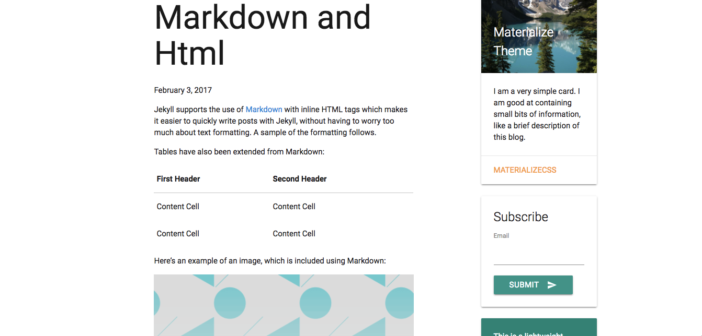

# Materialize CSS Theme

An open-source lightweight, minimalist, and responsive [Jekyll](http://jekyllrb.com/) blog styled using [Materialize CSS](materializecss.com/getting-started.html).

Forked from [Type Theme](https://github.com/rohanchandra/type-theme).

## Installation

You'll need to [install Jekyll](https://jekyllrb.com/docs/installation/) if you haven't already.

Once installing Jekyll run `bundle install` from the root directory. Then run `bundle exec jekyll server` and open up the relevant page (probably `localhost:4000`)! You may also want to append the flag `--force_polling` to watch for updates as you edit.

## Instructions
Materialize CSS Theme uses a similar configuration to Type Theme. Instructions for configuring and customizing the blog can be read [here](https://rohanchandra.github.io/project/type/). Instructions for customizing with Materialize CSS can be accessed [here](materializecss.com/getting-started.html).

## License
MIT

